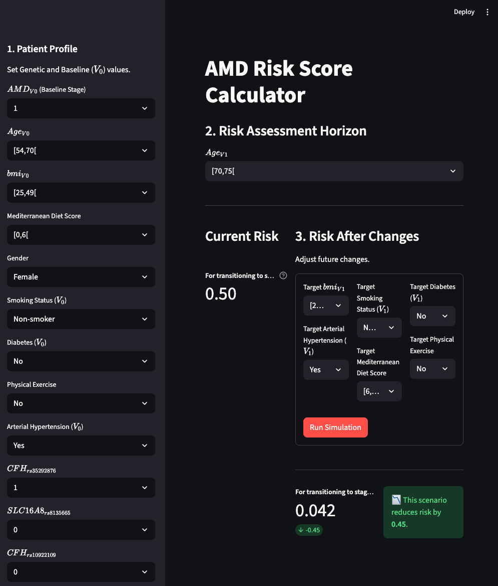

# AMD-Risk-VIA

A Python-based tool for calculating the **Risk Score** of Age-Related Macular Degeneration (AMD) progression. This project implements the novel **Variational Influence Analysis (VIA)** model to compute risk scores based on patient lifestyle, demographic, genetic, and environmental factors.

It includes both a command-line interface for batch processing and an interactive web dashboard for real-time clinical simulation.

## Project Overview

This tool allows researchers and clinicians to:

1. **Define Prediction Horizons:** Assess risk at specific future ages ($V_1$);
2. **Calculate the current Risk Score:** Predict the Risk Score of AMD progression for a specific patient assuming their profile remains unchanged;
3. **Simulate Counterfactuals:** Test "What-If" scenarios (e.g., *How does the Risk Score change if the patient stops smoking or starts exercising?*) to guide clinical advice.


## Repository Structure

```text
AMD-Risk-VIA/
├── via/                        # The VIA model engine
│   ├── __init__.py
│   └── engine.py               
├── Influence Scores/           # Model Parameters (Influence Scores) for different AMD stage transitions
│   ├── InfluenceScores_fixedSate1_AMD_cutoff0.xlsx
│   ├── InfluenceScores_fixedSate1_AMD_cutoff1.xlsx
│   ├── ... (others)
├── risk_model.py               # Main Model Class for computing Risk Scores
├── utils.py                    # Dictionaries for variable mapping and display names
├── app.py                      # Interactive Streamlit Web Dashboard
├── main.py                     # Command-line execution script
├── requirements.txt            # Python dependencies
└── README.md                   # Project documentation
```

## Getting Started

### 1. Prerequisites

Ensure you have Python 3.8+ installed.

### 2. Installation

Download the repository and install the required packages:

```bash
# If using the downloaded ZIP file, unzip it and navigate to the folder:
cd AMD-Risk-VIA
pip install -r requirements.txt
```

## 3. Usage

#### **Option A: Interactive Web Dashboard (Recommended)**

The easiest way to explore the model is via the Streamlit app. This provides a user-friendly interface to set patient history and run simulations without writing code.

streamlit run app.py

- **Sidebar:** Set the patient profile at baseline.
- **Main Panel:**
    - **Risk Assessment Horizon:** Select the target age ($V_1$).
    - **Current Risk:** View the Risk Score assuming current lifestyle continues.
    - **Risk After Changes:** Adjust future ($V_1$) factors to simulate interventions and see the new Risk Score.



*Figure 1: The Streamlit interface allowing real-time risk simulation.*

#### **Option B: Command Line**

To run a single calculation programmatically, you can use the `main.py` script.

python main.py

- You can edit the `patient_profile` dictionary inside `main.py` to test different patient scenarios programmatically.


## Methodology

The risk score is computed using the **Variational Influence Analysis (VIA)** model. This approach leverages Belief Propagation (BP) on a Factor Graph structure. 

The Factor Graph structure consists of: 
- **Variable Nodes:** Represent lifestyle, demographic, genetic, and environmental factors;
- **Function Nodes:** Represent the causal dependencies (Influence Scores) between factors and the risk.

### Key Variables

- **Genetics:** Variants such as _CFH, ARMS2, C3_, etc;
- **Demographics:** Age, Gender;
- **Lifestyle:** Smoking status, BMI, Mediterranean Diet Score, Physical Exercise;
- **Clinical History:** Hypertension, Diabetes, Baseline AMD Stage.


## Disclaimer

This tool is intended for research purposes only. It is not a diagnostic device. Clinical decisions should always be made by qualified healthcare professionals based on a comprehensive evaluation of the patient.
